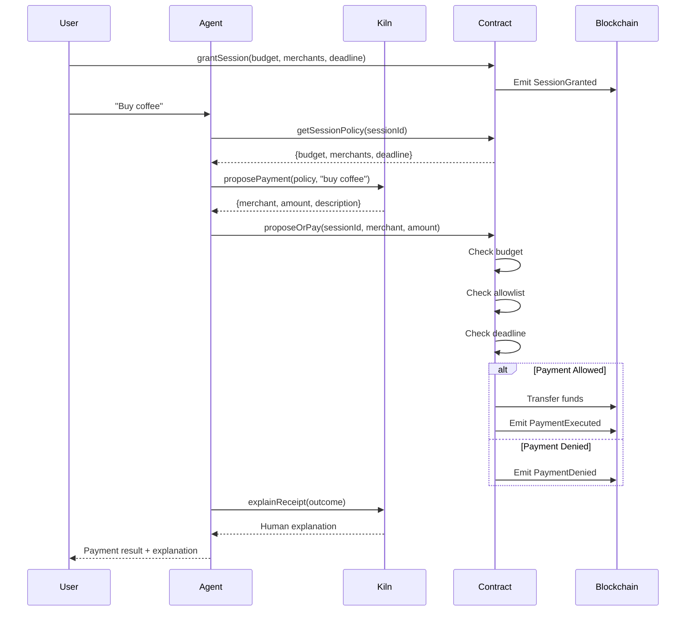

# KillSwitch Wallet Architecture

## Overview

KillSwitch Wallet implements a **cypherpunk approach** to AI agent spending controls: the agent proposes, but cryptographic enforcement disposes.

## Security Model

### Trust Boundaries

```
┌─────────────────────────────────────────────────────────┐
│                     UNTRUSTED ZONE                      │
│  ┌─────────────────────────────────────────────────┐   │
│  │          AI Agent (Kiln gpt-oss-120b)           │   │
│  │  - Reads policy (advisory only)                 │   │
│  │  - Proposes payments (no direct execution)      │   │
│  │  - Can attempt malicious proposals              │   │
│  └─────────────────────────────────────────────────┘   │
└─────────────────────────────────────────────────────────┘
                            ▼
              proposeOrPay(sessionId, merchant, amount)
                            ▼
┌─────────────────────────────────────────────────────────┐
│                     TRUSTED ZONE                        │
│  ┌─────────────────────────────────────────────────┐   │
│  │      SessionPolicy Smart Contract (EVM)         │   │
│  │  ✓ Enforces budget boundary                     │   │
│  │  ✓ Enforces merchant allowlist                  │   │
│  │  ✓ Enforces deadline                            │   │
│  │  ✓ Emits immutable events (audit trail)         │   │
│  │  ✓ Owner can freeze() for emergency stop        │   │
│  └─────────────────────────────────────────────────┘   │
└─────────────────────────────────────────────────────────┘
```

### Key Principles

1. **Zero Trust in Model**: The LLM is never trusted for enforcement
2. **Code is Law**: Smart contract enforces boundaries, not prompts
3. **Denial is Valid**: A denied payment is a correct, recorded outcome
4. **Evidence-Based**: On-chain events allow full reconstruction

## Component Architecture

### 1. SessionPolicy.sol (Smart Contract)

**Purpose**: Cryptographic enforcement of spending policy

**Core Functions**:
- `grantSession()`: Owner creates session with budget/allowlist/deadline
- `proposeOrPay()`: Agent submits payment; contract checks policy
- `freeze()`: Emergency stop by owner
- `closeSession()`: Return unused budget

**Events** (Immutable Audit Trail):
- `SessionGranted`: Policy parameters recorded
- `PaymentProposed`: Agent's proposal logged
- `PaymentExecuted`: Approved payment with tx hash
- `PaymentDenied`: Rejected payment with reason
- `SessionFrozen`: Emergency stop triggered

**Policy Checks** (On-Chain):
```solidity
✓ isMerchantAllowed[sessionId][merchant]
✓ spent + amount + fee <= budget
✓ block.timestamp <= deadline
✓ !frozen && active
```

### 2. Agent Module (TypeScript)

#### 2.1 KilnClient (`kiln-client.ts`)

**Purpose**: Interface to Kiln NPU API for gpt-oss-120b model

**Key Methods**:
- `proposePayment()`: Generate payment proposal (~500 tokens)
- `explainReceipt()`: Human-readable outcome (~300 tokens)

**NPU Optimization**:
- Single model call per proposal (no retry loops)
- Parallel inference possible (50+ req/sec)
- Token usage tracked per flow

**Mock Mode**: If no API key, generates synthetic proposals for demos

#### 2.2 PolicyReader (`policy-reader.ts`)

**Purpose**: Read on-chain policy state

**Key Methods**:
- `getSessionPolicy()`: Fetch budget/allowlist/deadline
- `getRemainingBudget()`: Calculate budget - spent
- `checkMerchant()`: Verify allowlist membership
- `getPaymentHistory()`: Query past events

**Note**: Readings are *advisory only* for agent. Contract re-checks at execution.

#### 2.3 PaymentProposer (`payment-proposer.ts`)

**Purpose**: Orchestrate propose → submit → explain flow

**Flow**:
1. Read policy from contract
2. Call Kiln LLM for proposal
3. Submit `proposeOrPay()` transaction
4. Parse events for outcome
5. Generate human explanation

**Security**: Agent cannot bypass contract checks

### 3. Demo Scripts (Bash)

#### `setup.sh`
- Deploy SessionPolicy contract
- Create initial session
- Build agent module

#### `01-success-payment.sh`
- Agent proposes payment within budget/allowlist
- Contract executes and emits `PaymentExecuted`
- Demonstrates happy path

#### `02-budget-exceeded.sh`
- Agent proposes 0.099 ETH on 0.1 ETH budget
- With 2% fee = 0.10098 ETH > budget
- Contract emits `PaymentDenied(reason: "Insufficient budget")`

#### `03-merchant-denied.sh`
- Agent proposes payment to `0xBAD...`
- Contract checks allowlist, emits `PaymentDenied(reason: "Merchant not allowed")`

## Data Flow

### Payment Proposal Flow



## Evidence & Reconstructability

### On-Chain Audit Trail

Any third party with contract address + RPC can reconstruct full history:

```bash
# Query all events
cast logs --address $CONTRACT_ADDRESS --from-block 0

# Filter payment executions
cast logs --address $CONTRACT_ADDRESS \
  --event "PaymentExecuted(uint256,address,uint256,uint256,bytes32)"

# Filter denials
cast logs --address $CONTRACT_ADDRESS \
  --event "PaymentDenied(uint256,address,uint256,string)"
```

### Reconstruction Proof

Given only:
1. Contract address
2. Session ID

Can prove:
- ✓ What budget was granted
- ✓ Which merchants were allowed
- ✓ Every payment proposal (allowed or denied)
- ✓ Exact reason for each denial
- ✓ Total amount spent
- ✓ Transaction hashes for verification

**No trusted party required** — blockchain is source of truth.

## Kiln NPU Integration

### Model: gpt-oss-120b

**Architecture**: 120B parameter GPT-style model, quantized for NPU inference

**Hardware**: Specialized Neural Processing Unit (NPU)
- Latency: ~100-200ms (vs 500ms+ CPU)
- Throughput: 50+ requests/sec per instance
- Cost: ~10x cheaper than GPU for this model size

### Agent Token Budget

| Flow               | Typical Tokens | Notes                          |
|--------------------|----------------|--------------------------------|
| `proposePayment()` | ~500           | Policy + reasoning             |
| `explainReceipt()` | ~300           | Transaction summary            |
| **Total per tx**   | **~800**       | Single round-trip, no retries  |

### Efficiency Assumptions

1. **No model-in-the-loop enforcement**: Policy checks are pure contract logic (O(1))
2. **No self-correction loops**: Agent proposes once, contract decides
3. **Parallel capability**: Multiple sessions can call Kiln concurrently
4. **Mock mode**: Demos work without API key (synthetic proposals)

## Extension Points

### Multi-Chain Support

Current: EVM (Anvil/Sepolia)

**Potential**:
- TRON (if challenge requires)
- L2 rollups (Optimism, Arbitrum)
- Cross-chain bridges for settlement

### Advanced Policies

- **ZK allowlists**: Privacy-preserving merchant approval
- **Rate limits**: Max transactions per hour
- **Approval voting**: Multi-sig for large payments
- **Recursive sessions**: Sub-budgets for different purposes

### Agent Capabilities

- **Receipt parsing**: Extract merchant name from on-chain data
- **Budget optimization**: Suggest best payment timing
- **Fraud detection**: Flag suspicious patterns
- **Reputation**: Slash agent stake for repeated denials

## Security Considerations

### What the Agent CANNOT Do

❌ Execute payments directly  
❌ Modify policy boundaries  
❌ Forge events  
❌ Bypass contract checks  
❌ Freeze/close sessions it doesn't own  

### What the Agent CAN Do

✓ Read policy state (public view functions)  
✓ Propose arbitrary payments (contract filters)  
✓ Query past transactions  

### Attack Scenarios

| Attack | Mitigation |
|--------|-----------|
| Agent proposes max budget repeatedly | Contract enforces cumulative limit |
| Agent proposes to unlisted merchant | Contract checks allowlist |
| Agent waits until after deadline | Contract checks `block.timestamp` |
| Agent front-runs owner's freeze() | Owner tx has higher priority; freeze is instant |
| Malicious contract upgrade | Contract is non-upgradable (immutable deployment) |

## Testing Strategy

### Unit Tests (Foundry)

- ✓ Session creation
- ✓ Successful payment execution
- ✓ Budget exceeded denial
- ✓ Merchant allowlist denial
- ✓ Deadline expiry denial
- ✓ Freeze functionality
- ✓ Close and refund

### Integration Tests (Demo Scripts)

- ✓ End-to-end success flow
- ✓ Boundary violation recording
- ✓ Event emission verification
- ✓ Agent + contract coordination

### Property Tests (Future)

- Budget never exceeded
- Only allowlisted merchants receive funds
- Events match state changes
- Freeze halts all payments

## Performance Characteristics

| Metric | Value | Notes |
|--------|-------|-------|
| Contract deployment | ~500k gas | One-time cost |
| `grantSession()` | ~150k gas | Per session |
| `proposeOrPay()` (success) | ~80k gas | Includes transfer |
| `proposeOrPay()` (denial) | ~50k gas | No transfer |
| `freeze()` | ~30k gas | Emergency stop |
| Kiln inference | ~150ms | P50 latency |
| End-to-end payment | ~2s | Proposal + execution + confirmation |

## Compliance & Auditability

### Regulatory Compliance

- **KYC/AML**: Merchant allowlist can map to verified entities
- **Spending limits**: Budget enforces jurisdictional caps
- **Audit trail**: Blockchain provides immutable log

### Audit Process

1. **Code audit**: Review SessionPolicy.sol for vulnerabilities
2. **Agent review**: Verify no bypass logic in TypeScript
3. **Integration test**: Run demos to confirm boundaries
4. **Event replay**: Reconstruct all payments from chain data

### Transparency

- Contract source code verified on Etherscan
- All events public and queryable
- No off-chain secrets required for reconstruction
