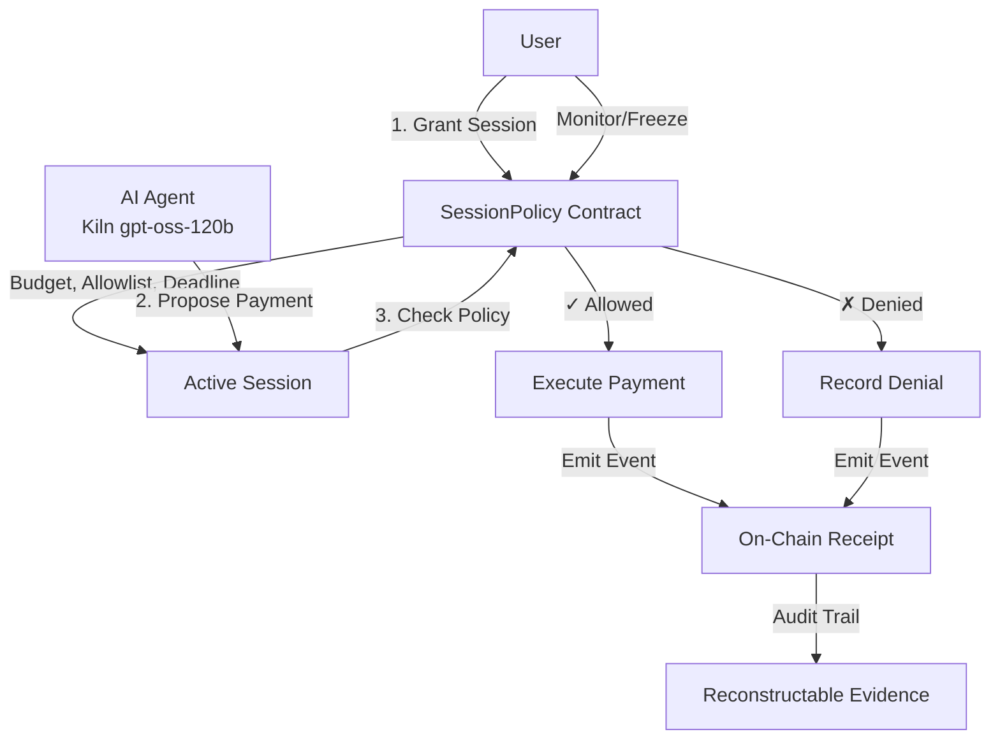

# KillSwitch Wallet

[](https://github.com/rectinajh/killswitch-wallet/actions)
[](https://opensource.org/licenses/MIT)
[](https://soliditylang.org/)
[](https://www.typescriptlang.org/)

**Furiosa Challenge B (GWDC 2026 Korea)** — AI Agent spending controls & records (cypherpunk)

## Declared Function

**KillSwitch Wallet lets a user delegate a time-bounded, merchant-whitelisted budget to an AI agent, enforces that boundary in code/on-chain (not by trusting the model), and leaves an auditable trail so anyone can reconstruct whether a payment was authorized.**

### User Need
Intended for users who want an LLM agent to buy/pay on their behalf without unbounded spending risk.

**Problem**: Traditional payment rails record *who paid whom*, but not *who authorized it* or *under what conditions*.

**Solution**: A session-capability system where the agent proposes payments, but enforcement happens in smart contracts and on-chain records — never by trusting the model.

## Cypherpunk Design Principles

1. **Agent proposes; policy contract disposes** — Stopping/deny is a correct recorded outcome
2. **Least privilege** — Session capability with budget, merchant allowlist, deadline
3. **Don't trust the model** — Enforce boundaries in code + on-chain, not in prompts
4. **Evidence** — Another person with only your records can reconstruct authorization

## Architecture



## What the Agent Does vs What Code Enforces

| Capability | Agent (Kiln gpt-oss-120b) | Smart Contract / Code |
|------------|---------------------------|----------------------|
| **Read Policy** | ✓ Can query current budget/allowlist | N/A |
| **Propose Payment** | ✓ Suggests merchant & amount | ✗ Cannot execute directly |
| **Check Allowlist** | ✗ Advisory only, not enforced | ✓ **Enforced on-chain** |
| **Check Budget** | ✗ Advisory only, not enforced | ✓ **Enforced on-chain** |
| **Check Deadline** | ✗ Advisory only, not enforced | ✓ **Enforced on-chain** |
| **Record Outcome** | ✗ Cannot forge | ✓ **Immutable event logs** |
| **Emergency Stop** | ✗ Cannot override | ✓ **Owner freeze()** |

## Project Structure

```
killswitch-wallet/
├── contracts/           # Foundry smart contracts
│   ├── src/
│   │   ├── SessionPolicy.sol       # Core policy enforcement
│   │   └── KillSwitchVault.sol     # Payment execution
│   ├── test/
│   └── script/          # Deployment scripts
├── agent/               # TypeScript AI agent
│   ├── src/
│   │   ├── kiln-client.ts          # Kiln API integration
│   │   ├── policy-reader.ts        # On-chain policy queries
│   │   └── payment-proposer.ts     # Agent payment logic
│   └── package.json
├── demos/               # Demonstration scripts
│   ├── 01-success-payment.sh
│   ├── 02-budget-exceeded.sh
│   └── 03-merchant-denied.sh
└── README.md
```

## Setup Instructions

### Prerequisites

- **Node.js** 18+ and pnpm
- **Foundry** (forge, anvil, cast)
- **Kiln API Key** (for gpt-oss-120b model)

### 1. Install Dependencies

```bash
# Install Foundry (if not already installed)
curl -L https://foundry.paradigm.xyz | bash
foundryup

# Install Node dependencies
cd agent
pnpm install
```

### 2. Configure Environment

```bash
# Copy environment template
cp .env.example .env

# Edit .env — default LLM is Kiln (Furiosa official):
#   LLM_PROVIDER=kiln
#   KILN_MODEL=gpt-oss-120b
#   KILN_API_KEY=your_key_here
# Owner vs agent keys (Anvil #0 owner, #1 agent):
#   OWNER_PRIVATE_KEY=...   # grant / freeze / close
#   AGENT_PRIVATE_KEY=...   # proposeOrPay (PRIVATE_KEY is an alias for agent)
# Optional local LLM: LLM_PROVIDER=kimi
```

### 3. Start Local Blockchain

```bash
# Terminal 1: Start Anvil local testnet
anvil
```

### 4. Deploy Contracts

```bash
# Terminal 2: Deploy to local testnet
cd contracts
forge build
forge script script/Deploy.s.sol --rpc-url http://127.0.0.1:8545 --broadcast
```

### 5. Run Demonstrations

```bash
# Terminal 2: Run demo scenarios
cd demos

# Success case: payment within budget and allowlist
./01-success-payment.sh

# Boundary case: budget exceeded
./02-budget-exceeded.sh

# Boundary case: merchant not on allowlist
./03-merchant-denied.sh
```

## Acceptance Criteria Demonstrated

### 1. ✓ Declared Function
README clearly states what the agent does vs what code enforces (see table above).

### 2. ✓ Boundaries & Stopping
Two forced out-of-scope denial scenarios:
- **Budget Exceeded**: `02-budget-exceeded.sh` — Agent proposes $150 payment, but budget is $100 (after fees). Contract denies and emits `PaymentDenied(reason: "Insufficient budget")`.
- **Merchant Not Allowlisted**: `03-merchant-denied.sh` — Agent proposes payment to `0xBAD...`, but only `[0xMERCHANT1, 0xMERCHANT2]` are allowed. Contract denies and emits `PaymentDenied(reason: "Merchant not allowed")`.
- **Deadline Expired**: (Optional) Contract checks `block.timestamp > deadline`.

### 3. ✓ Kiln API Integration
- Agent uses `gpt-oss-120b` model via Kiln API
- Token usage reported per flow:
  - `proposePayment()`: ~500 tokens (merchant reasoning)
  - `explainReceipt()`: ~300 tokens (transaction summary)
- Efficiency: Model only generates proposal; enforcement is O(1) contract logic
- Mock client provided if no API key (logs requests, returns synthetic responses)

### 4. ✓ Blockchain On-Chain Transaction
- Every demo run produces at least one on-chain transaction:
  - `grantSession()`: Creates session with policy parameters
  - `proposeOrPay()`: Emits `PaymentExecuted` or `PaymentDenied`
- Scripts print transaction hash with matching log entries:
  ```
  ✓ Session created: 0x1234...
  ✓ Payment proposed: 0x5678...
    → Event: PaymentDenied(sessionId=1, reason="Budget exceeded")
  ```

### 5. ✓ Approval & Evidence
- **Human grants budget**: `grantSession()` signed by owner
- **Watch spend**: Query `spent` and `remaining` from contract
- **Emergency stop**: Owner can call `freeze()` to halt session
- **Receipt**: On-chain events provide complete audit trail
- **Reconstructability**: Anyone with contract address + RPC can rebuild full history:
  ```bash
  cast logs --address $CONTRACT --from-block 0 | jq
  ```

## NPU / energy assumptions

Official LLM path: **Kiln `gpt-oss-120b`** (`LLM_PROVIDER=kiln`). See **[JUDGE.md](JUDGE.md)** and **[docs/ENERGY_ASSUMPTIONS.md](docs/ENERGY_ASSUMPTIONS.md)** for token capture and energy reporting.

**Do not invent joules.** If no meter: report tokens only; state kit-doc watt assumptions or `UNKNOWN`. Unverifiable “Nx cheaper than GPU” claims are omitted here — judges should use measured prompt/completion splits from the console/API.

Agent design minimizes model calls:
- Policy checks: pure on-chain reads (no LLM)
- Payment proposal: single short JSON LLM call per user intent (`reasoning_effort=low` when supported)
- No retry loops or self-correction via LLM

## Development Roadmap (Post-Hackathon)

- [ ] Multi-session support (parallel budgets)
- [ ] Fiat on/off-ramp integration (Stripe → USDC)
- [ ] ZK proofs for private merchant allowlists
- [ ] Cross-chain settlement (L2 optimistic rollups)
- [ ] Agent reputation/slashing for malicious proposals

## License

MIT

## Challenge Submission

**Furiosa Challenge B — GWDC 2026 Korea**  
Team: [Your Team Name]  
Demo Video: [Link to recorded demo]

---

**Built with**: Foundry, TypeScript, Kiln NPU API, EVM (Anvil/Sepolia)


## Local verification (Mac, 2026-09-20)

Verified on Anvil without cloud agents:

- `forge test`: **8 passed** (agent binding, deadline deny event, fee refund) (after renaming error `SessionIsFrozen` to avoid clashing with event `SessionFrozen`)
- `./demos/setup.sh` requires Foundry **`--broadcast`** on `forge create`
- Demos:
  - `01-success-payment.sh` → `PaymentExecuted`, spent `5.1e16` wei for 0.05 ETH + 2% fee
  - `02-budget-exceeded.sh` → `PaymentDenied` reason `Insufficient budget`, spent `0`
  - `03-merchant-denied.sh` → `PaymentDenied` reason `Merchant not allowed`, spent `0`
  - `04-freeze-session.sh` → `proposeOrPay` reverts with `SessionIsFrozen`
- Agent mock mode works (`KILN_API_KEY` unset/placeholder): proposes then submits on-chain tx

Quick path:

```bash
anvil --host 127.0.0.1 --port 8545 --block-time 1
cp -n .env.example .env   # quote USER_INTENT
./demos/setup.sh
./demos/01-success-payment.sh
./demos/02-budget-exceeded.sh
./demos/03-merchant-denied.sh
./demos/04-freeze-session.sh
```

## Acceptance mapping (Furiosa Challenge B)

| Criterion | Where it shows |
|---|---|
| Declared function & user need | This README § Declared Function |
| Workflow user → outcome | `demos/` + `apps/console` |
| Agent task vs code | Table above; contract enforces |
| Boundaries & stopping (≥2 out-of-scope runs) | `02`/`03` cast demos + `demos/agent-boundary.mjs` (agent path) + `04-freeze-session` |
| Kiln `gpt-oss-120b` | Furiosa official via `LLM_PROVIDER=kiln`; local demos may use `LLM_PROVIDER=kimi`. Mock without key. |
| On-chain tx + hash | Every demo prints tx hash; events `PaymentExecuted` / `PaymentDenied` |
| Human approve / watch / stop / receipt | Console grant/freeze/events; `scripts/audit-session.sh` |
| Third-party reconstructability | On-chain policy + event logs only |

## Fee model (budget = amount + 2%)

On-chain in `SessionPolicy.proposeOrPay`:

```solidity
uint256 fee = (amount * 2) / 100;  // 2%
uint256 totalCost = amount + fee;  // charged against session budget
```

Agent helper `feeWei(amount)` / `totalCostWei(amount)` in `agent/src/fees.ts` keeps receipts and UI aligned with the contract (not a bare `"(2%)"` string).

## LLM providers (dual path)

| Context | Provider | Model / env |
|---------|----------|-------------|
| **Default / Furiosa official** | Kiln | `LLM_PROVIDER=kiln`, `KILN_MODEL=gpt-oss-120b` |
| Optional local | Kimi (Moonshot) | `LLM_PROVIDER=kimi`, `KIMI_MODEL=…` |

Never commit real API keys. See [KILN_SETUP.md](KILN_SETUP.md), [JUDGE.md](JUDGE.md), and `.env.example`.

### Owner vs agent keys

| Role | Env var | Signs |
|------|---------|--------|
| Owner | `OWNER_PRIVATE_KEY` | `grantSession`, `freeze`, `closeSession` |
| Agent | `AGENT_PRIVATE_KEY` (alias: `PRIVATE_KEY`) | `proposeOrPay` |

Live demo: **https://killswitch-wallet.vercel.app**

## Trust boundary

Agent proposes → Contract disposes → Evidence on-chain. **PaymentDenied is a success outcome** (boundary held). Deeper narrative: [ARCHITECTURE.md](ARCHITECTURE.md).

## One-click demo

```bash
./demos/demo-up.sh          # anvil (if needed) → setup → agent build → console
./demos/run-all.sh          # cast demos 01–04
node demos/agent-boundary.mjs all   # TS agent path: over-budget + off-allowlist
```

## Web console

```bash
./demos/demo-up.sh
# or: node apps/console/server.mjs
# http://127.0.0.1:8787
```

Cyber/ops UI: Policy / Agent / Chain panels, fee-aware receipts, boundary demo buttons, live Watch.

## Deploy (Vercel)

The console (`apps/console/server.mjs`) runs as a Vercel Node serverless function. All routes (`/`, `/index.html`, `/api/*`) are rewritten to `api/index.mjs`.

### Auto-deploy on push to `main`

Workflow: [`.github/workflows/deploy-vercel.yml`](.github/workflows/deploy-vercel.yml).

On every push to `main` (or manual **workflow_dispatch**), GitHub Actions runs:

1. `vercel pull` (production)
2. `vercel build --prod`
3. `vercel deploy --prebuilt --prod`

Required **GitHub Actions secrets** (repo → Settings → Secrets):

| Secret | Description |
|--------|-------------|
| `VERCEL_TOKEN` | Vercel account token |
| `VERCEL_ORG_ID` | Team/org id from `.vercel/project.json` after `vercel link` |
| `VERCEL_PROJECT_ID` | Project id from `.vercel/project.json` |

One-time link (local, non-CI):

```bash
npm i -g vercel
vercel link          # creates .vercel/ (gitignored)
vercel --prod        # optional first deploy
```

### App environment variables (Vercel dashboard)

Set these under **Project → Settings → Environment Variables** (Production). Do not commit real values.

| Variable | Required | Notes |
|----------|----------|-------|
| `RPC_URL` | yes | Public RPC (not `127.0.0.1`) |
| `OWNER_PRIVATE_KEY` | yes | Grant / freeze / close |
| `AGENT_PRIVATE_KEY` | yes | Propose (or `PRIVATE_KEY` alias) |
| `CONTRACT_ADDRESS` | yes | Deployed `SessionPolicy` |
| `LLM_PROVIDER` | yes | Default `kiln` (Furiosa); optional `kimi` |
| `KIMI_API_KEY` | if kimi | Or leave placeholder for mock mode |
| `KILN_API_KEY` | if kiln | Or leave placeholder for mock mode |

Optional: `KIMI_MODEL`, `KIMI_API_BASE_URL`, `KILN_MODEL`, `KILN_API_BASE_URL`.

### Local vs Vercel

```bash
# Local (listens on CONSOLE_PORT, default 8787)
npm run vercel-build   # build agent + install console deps
node apps/console/server.mjs

# Vercel: handler only (no listen); env from dashboard; process.env.VERCEL is set
```

Build on Vercel uses root `package.json` script `vercel-build` (builds `agent/`, installs `apps/console` deps). See `vercel.json`.

## Gas / Foundry

```bash
cd contracts && forge test          # expect 8 passed
# Optional local gas snapshot (commit .gas-snapshot only if you generate it):
# forge snapshot
```
