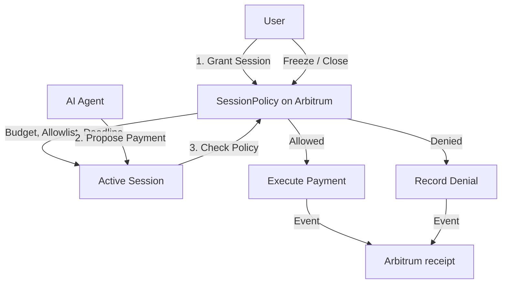

# KillSwitch Wallet

[](https://github.com/rectinajh/killswitch-wallet/actions)
[](https://opensource.org/licenses/MIT)
[](https://soliditylang.org/)
[](https://www.typescriptlang.org/)

**Agent spend controls on Arbitrum** — an AI agent discovers, quotes, and pays under a Session Key; `SessionPolicy` Guards on-chain; `PaymentDenied` is a recorded success.

Built for the [Arbitrum Open House Singapore Online Buildathon](https://www.hackquest.io/hackathons/Arbitrum-Open-House-Singapore-Online-Buildathon).

## One-liner

You grant a time-bounded Session Key (budget · merchant allowlist · deadline). The agent only **proposes**; the contract **guards**; you can **Freeze** or **Close + refund**. Do not trust the model.

## Declared function

**User grants a time-bounded, merchant-whitelisted budget; the agent checks out under that policy; the contract enforces and leaves a merchant-verifiable `CommercePaymentCredential` + on-chain events.**

**User need:** Let an LLM buy coffee or settle an API bill while you are offline — without unbounded spend or silent off-allowlist payments.

## Live on Arbitrum Sepolia (`chainId` `421614`)

| | |
|--|--|
| Contract | [`0x5A035E67d5b5A895e71e14B6C9201952C81350df`](https://sepolia.arbiscan.io/address/0x5A035E67d5b5A895e71e14B6C9201952C81350df) |
| Deploy block | `315227756` |
| Session 4 grant | [`0xde3e…4303`](https://sepolia.arbiscan.io/tx/0xde3ef396d1b7fc0cb04c170df4841d0f672c6dce04429e545bd8fbe9f2ee4303) |
| `PaymentExecuted` (coffee) | [`0x1fbe…7d0c`](https://sepolia.arbiscan.io/tx/0x1fbe7e9d4f8060b7ab3fc91bd831cfdc9f383fd65bea1dc07426c9295aed7d0c) |
| `PaymentDenied` (Shadow Shop) | [`0x6099…3ff6`](https://sepolia.arbiscan.io/tx/0x609919e0fb25c503af5b9ab7632669ae07be0ffca0a1d547fd34f3b3d1383ff6) |
| Freeze | [`0x0bff…74bf`](https://sepolia.arbiscan.io/tx/0x0bff1b859133bceddc4c836bf2c81684c4eae13bff91b21edd6ad205e22d74bf) |

Submission media: [`docs/submission/`](docs/submission/) · 90s pitch: [`docs/PITCH.md`](docs/PITCH.md) · [`docs/ARBITRUM_BUILDATHON.md`](docs/ARBITRUM_BUILDATHON.md) · Verify: `./scripts/verify-arbitrum-sepolia.sh` · Vercel: [`docs/VERCEL_ARB.md`](docs/VERCEL_ARB.md) · USDG: [`docs/USDG_ROADMAP.md`](docs/USDG_ROADMAP.md) · Robinhood P2: [`docs/ROBINHOOD.md`](docs/ROBINHOOD.md)

## Demo contrast (what judges should see)

1. In-limit checkout → `PaymentExecuted` + credential (Arbiscan link)
2. Over-budget (amount + 2% fee) → `PaymentDenied`
3. Off-allowlist / Shadow Shop → `PaymentDenied`
4. User Freeze / Close → agent loses capability / refund

## Architecture


```mermaid
graph TB
    User[User] -->|1. Grant Session| Contract[SessionPolicy on Arbitrum]
    Contract -->|Budget, Allowlist, Deadline| Session[Active Session]
    Agent[AI Agent] -->|2. Propose Payment| Session
    Session -->|3. Check Policy| Contract
    Contract -->|Allowed| Payment[Execute Payment]
    Contract -->|Denied| Deny[Record Denial]
    Payment -->|Event| Chain[Arbitrum receipt]
    Deny -->|Event| Chain
    User -->|Freeze / Close| Contract
```

| Capability | Agent | Contract |
|------------|-------|----------|
| Read policy | ✓ | on-chain state |
| Propose payment | ✓ | ✗ cannot bypass |
| Allowlist / budget / deadline | advisory only | **enforced** |
| Record outcome | ✗ | **events** |
| Emergency stop | ✗ | **owner `freeze()`** |

## Fee model

```solidity
uint256 fee = (amount * 2) / 100;  // 2%
uint256 totalCost = amount + fee;  // charged against session budget
```

Helpers in `agent/src/fees.ts` stay in sync with the contract.

## Keys

| Role | Env | Signs |
|------|-----|-------|
| Owner | `OWNER_PRIVATE_KEY` | `grantSession`, `freeze`, `closeSession` |
| Agent | `AGENT_PRIVATE_KEY` (alias `PRIVATE_KEY`) | `proposeOrPay` |

## Quick start (Arbitrum Sepolia)

```bash
cp .env.example .env
# Set RPC_URL + ARB_SEPOLIA_RPC_URL to Arbitrum Sepolia
# Fund OWNER_PRIVATE_KEY and AGENT_PRIVATE_KEY

./scripts/deploy-arbitrum-sepolia.sh
# or: ./demos/setup.sh

./scripts/check-arbitrum-path.sh   # expect ARB_PATH_OK
./demos/01-success-payment.sh
./demos/02-budget-exceeded.sh
./demos/03-merchant-denied.sh

npm run assemble-console && npm run console
# http://127.0.0.1:8787
```

Local Anvil still works for development (`RPC_URL=http://127.0.0.1:8545` + `./demos/demo-up.sh`).

### Vercel console env

| Variable | Purpose |
|----------|---------|
| `RPC_URL` | Arbitrum Sepolia JSON-RPC |
| `OWNER_PRIVATE_KEY` / `AGENT_PRIVATE_KEY` | Funded throwaways |
| `CONTRACT_ADDRESS` | Deployed `SessionPolicy` |
| `CONTRACT_DEPLOY_BLOCK` | Deploy block for log scans |
| `CHAIN_LABEL` | `arbitrum-sepolia` |
| `LLM_PROVIDER` + API key | Optional (`kimi` / `kiln`; missing → mock) |

## Project structure

```
killswitch-wallet/
├── contracts/           # SessionPolicy (Foundry)
├── agent/               # Propose via LLM; submit to contract
├── apps/console/        # Judge UI + commerce funnel
├── demos/               # Cast + agent boundary demos
├── scripts/             # deploy/check Arbitrum path
├── docs/                # ARBITRUM_BUILDATHON, AA roadmap, submission media
└── README.md
```

## Tests & trust boundary

```bash
cd contracts && forge test   # expect 8 passed
```

Agent proposes → contract disposes → evidence on Arbitrum. **`PaymentDenied` is a success outcome.**

Roadmap (AA / Smart Sessions): [`docs/AA_SESSION_KEY.md`](docs/AA_SESSION_KEY.md).

## License

MIT
